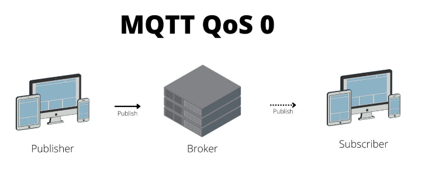
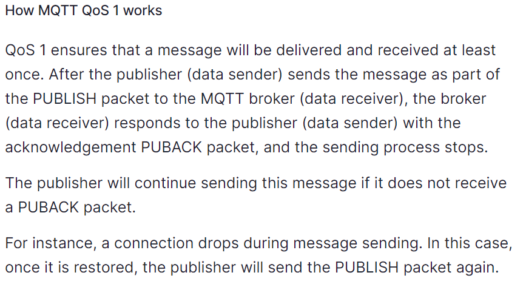
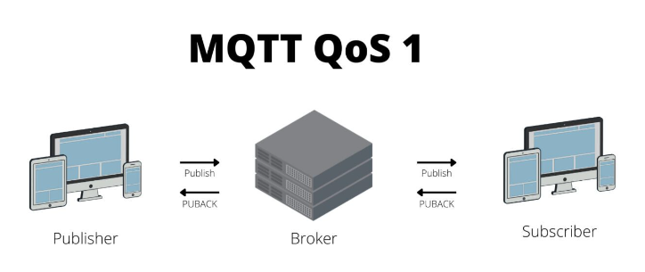
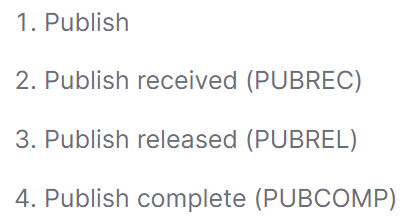
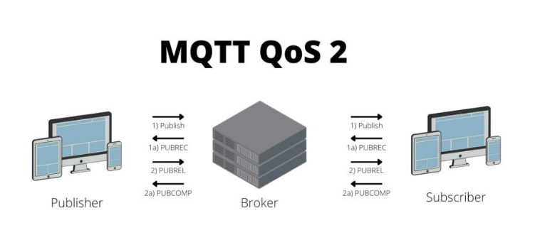
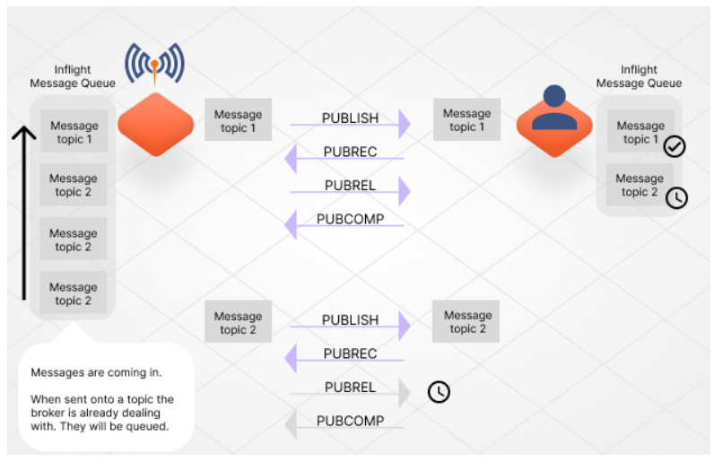
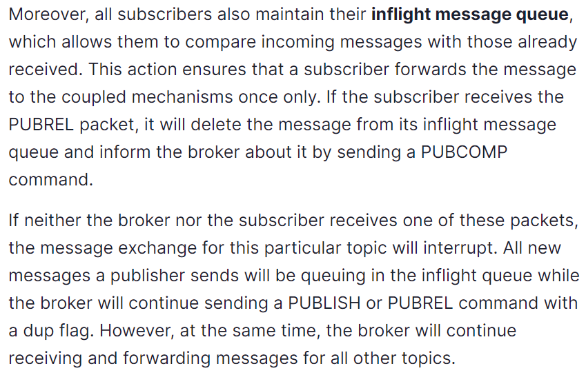

# `QOS` (quality of service)

# _thumb rule_
> - setting the QoS level is typically mandatory for the `publisher` but optional for the `subscriber`. 

> - if a subscriber does not specify a qos level during subscription, qos level set by the publisher as the default for that subscriber.   


-   `QOS 0` - LOWEST LEVEL SERVICE 
- `QOS 2` - HIGHEST ONE LEVEL SERVICE `(reliable but also the slowest)`
## ```Quality of Service (QoS) Levels```

In the context of messaging systems, Quality of Service (QoS) levels determine the reliability and guarantee of message delivery between a publisher (sender) and a subscriber (receiver). There are three commonly used QoS levels:

| `QoS Level  `     | `Publisher Description`                                            | `Subscriber Description   `                                    |
|-----------------|----------------------------------------------------------------|--------------------------------------------------------------|
| `0: At Most Once `| Will send a message only once.                                  | Might receive or might not receive the message.              |
| `1: At Least Once`| Will send a message at least once as long as an acknowledgement is received or the command to end the transmission is received. | It is likely to receive the message at least once (it is possible that the message can be received more than once). |
| `2: Exactly Once `| Will only send a message once.                                  | Will only receive the message once.                           |

# QOS 0 - "fire and forget" method 
 
- QoS 0 only guarantees that a message is sent but does not guarantee that it is received.

- broker does not wait for an acknowledgement from the receiver. 




# QOS 1 

- things get a little more complex. The publisher will send a message at least once and will continue sending it until the broker receives an acknowledgement.
 



# QOS 2 

## why it is slow service?

Every message delivery requires a four-part verification between both parts `PUBLISHER AND BROKER` and `the broket and a subscriber`. this process is tedious, but process ensures that subscribers receive a message exactly once. 

## How MQTT QOS 2 Works 



- After the data sender sends a `PUBLISH` packet to the data `RECEIVER`, the receiver answers with a PUBREC command to confirm the receipt ot the PUBLISH packet. 


- Once the data sender gets the `PUBREC` packet, it deletes the initials `PUBLISH` packet while keeping the PacketID and the `PUBREC` packet.

- The data sender then sends a `PUBREL` packet to the data receiver to confirm the receipt of the `PUBREC` packet the former received from it. 

- In the end, the data receiver sends a `PUBCOMP` packet with the PacketID of the initial `PUBLISH` packet to the data sender, indicating that the message delivery has been successful.







# `level of publisher and subscriber for qos`

## `Publisher Sets QoS 1 (At Least Once) and Subscriber Sets QoS 0 (At Most Once):`

`Publisher`: Messages are sent with QoS 1, meaning that the publisher requests an acknowledgment (PUBACK) from the broker to confirm that the message has been received. The broker will store the message until the acknowledgment is received.

`Subscriber`: Since the subscriber requests QoS 0, it does not expect acknowledgments or delivery guarantees. The broker will send the message to the subscriber without waiting for acknowledgment. If the message cannot be delivered immediately, it may be lost, and the subscriber won't be aware of it.

`Outcome`: The publisher will ensure at least once delivery, but the subscriber may receive duplicate messages if the acknowledgment is lost or delayed.

## `Publisher Sets QoS 0 (At Most Once) and Subscriber Sets QoS 1 (At Least Once):`

`Publisher`: Messages are sent with QoS 0, indicating that the publisher does not require acknowledgments or delivery guarantees. The broker delivers the message once without storage or acknowledgment.

`Subscriber`: The subscriber requests QoS 1, which means it expects acknowledgments from the broker. The broker may send the message at least once to ensure reliability.

`Outcome`: The publisher sends messages without reliability guarantees, and the subscriber may not receive all messages, especially if there are network issues or message loss.

## `Publisher Sets QoS 2 (Exactly Once) and Subscriber Sets QoS 0 (At Most Once):`

`Publisher`: Messages are sent with QoS 2, indicating that the publisher requires exactly-once delivery. This involves a more complex handshake with acknowledgments (PUBREC, PUBREL, and PUBCOMP) to ensure exactly-once semantics.

`Subscriber`: The subscriber requests QoS 0, meaning it does not expect acknowledgments or reliability guarantees.

`Outcome`: The publisher will ensure exactly-once delivery, but the subscriber may receive messages at most once, and there's no guarantee of receiving all messages.